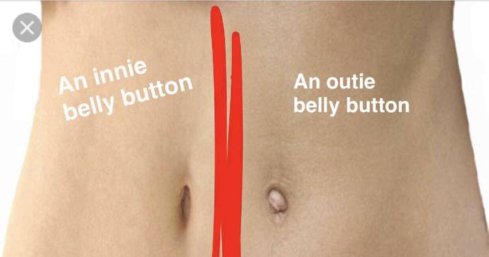

# Plot.ly Homework - Belly Button Biodiversity

&nbsp;

I tell our kids all the time to wash their belly button!  Do they listen?  No!

Well lets find out what kind of bacteria live in their and other's belly buttons...

With this dashboard you can select various subject's and see what is living in 

their belly buttons.

&nbsp;

I always wanted and outy and after looking at the data, outies are probably 

cleaner than innies!  Wonder if covid-19 can survive in an innie?!